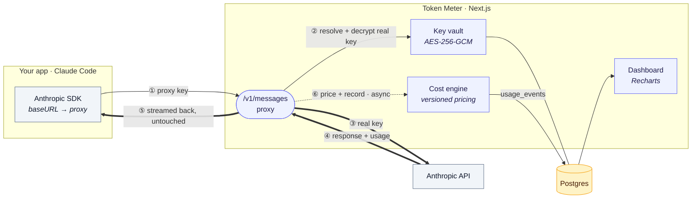

# Token Meter

Track LLM token usage and cost by routing your Anthropic traffic through a **proxy**.
Every request's `usage` is captured, priced, and shown on a dashboard — near-exact,
per-request.

**Stack:** Next.js (App Router, TS) · Postgres + Drizzle · Better Auth · Tailwind · Recharts

## Architecture



Point your SDK at the proxy with a **Token Meter key**; we resolve it to your encrypted
Anthropic key, forward the call, stream the response back **untouched**, and record priced
`usage` **off the hot path** into Postgres for the dashboard. Same tokens, same cost, same
response — the proxy only observes.

## Prerequisites

- [Bun](https://bun.sh) 1.x
- Postgres running locally (e.g. `brew services start postgresql@17`)

## Setup

```bash
bun install
createdb llm_usage                 # or: psql -c 'create database llm_usage'
cp .env.example .env.local         # then fill in the values below
bun run db:push                    # create tables
bun run db:seed                    # seed Anthropic model pricing
bun run dev                        # http://localhost:6573
```

`.env.local` values:

| Var | What |
|---|---|
| `DATABASE_URL` | `postgresql://<user>@localhost:5432/llm_usage` |
| `MASTER_ENCRYPTION_KEY` | base64 of 32 random bytes — encrypts provider keys at rest (swap for KMS in prod) |
| `SESSION_SECRET` | base64 of 32 random bytes — signs session cookies |
| `ANTHROPIC_BASE_URL` | upstream (`https://api.anthropic.com`) |
| `BETTER_AUTH_URL` / `BETTER_AUTH_SECRET` | auth base URL + signing secret |
| `GOOGLE_CLIENT_ID` / `GOOGLE_CLIENT_SECRET` | Google sign-in (optional) |

Generate a secret: `node -e "console.log(require('crypto').randomBytes(32).toString('base64'))"`

## Using it

1. Sign up at `/signup` (email/password or Google).
2. Under **Keys**, add your Anthropic key — stored AES-256-GCM encrypted, only last 4 shown.
3. Issue a **proxy key** (shown once) and point your SDK at the proxy:

```ts
const client = new Anthropic({
  baseURL: "http://localhost:6573",      // proxy ORIGIN — the SDK appends /v1/messages
  apiKey: process.env.LLMUSAGE_PROXY_KEY, // your proxy key, NOT your Anthropic key
});
```

> For the official Anthropic SDK, `baseURL` is the **origin** (no `/v1`). For raw `curl`,
> hit the full path yourself: `http://localhost:6573/v1/messages`.

Make requests as usual — streaming and non-streaming both work. Usage and cost land on the
**Overview** dashboard, filterable by date range (24h / 7d / 30d / 90d).

## Features

- **Auth** — email/password + Google (Better Auth), one org per signup.
- **Key vault** — provider keys encrypted with AES-256-GCM; proxy keys stored as SHA-256 hashes, shown once.
- **Proxy** — transparent `POST /v1/messages` passthrough; captures input/output/cache tokens. Metric writes are fire-and-forget, so a DB hiccup never breaks your LLM call.
- **Cost engine** — versioned pricing with exact cache math (5m 1.25× · 1h 2× · read 0.1×) and effective-dated rows (e.g. Sonnet 5 intro pricing).
- **Dashboard** — spend over time, cost by model, cache-hit ratio, recent requests.

## Scripts

| Script | Purpose |
|---|---|
| `bun run dev` / `build` / `start` | Next.js (port 6573) |
| `bun run db:push` | Apply the Drizzle schema to Postgres |
| `bun run db:seed` | Seed model pricing |
| `bun run db:demo` | Insert ~320 sample usage events (charts demo) |
| `bun run db:studio` | Drizzle Studio |
