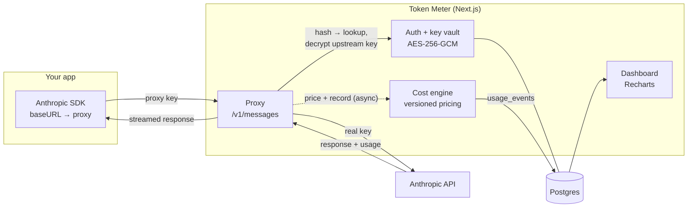

# Token Meter

Track LLM token usage and cost across providers via a **proxy/gateway**. Users route
their Anthropic traffic through the proxy; every request's `usage` is captured, priced,
and rendered in a dashboard. See [`ARCHITECTURE.md`](./ARCHITECTURE.md) for the design.

Stack: Next.js (App Router, TS) · Postgres + Drizzle · Tailwind · Recharts.

## Architecture



The user points their SDK at the proxy with a Token Meter key; we resolve it to their
encrypted Anthropic key, forward the call, stream the response back untouched, and
record priced `usage` off-path into Postgres for the dashboard. See
[`ARCHITECTURE.md`](./ARCHITECTURE.md) for the full design.

## Prerequisites

- Node 20+, pnpm
- Postgres running locally (e.g. `brew services start postgresql@17`)

## Setup

```bash
pnpm install
createdb llm_usage                 # or: psql -c 'create database llm_usage'
cp .env.example .env.local         # then fill in the values below
pnpm db:push                       # create tables
pnpm db:seed                       # seed Anthropic model pricing
pnpm dev                           # http://localhost:3000
```

`.env.local` values:

| Var | What |
|---|---|
| `DATABASE_URL` | `postgresql://<user>@localhost:5432/llm_usage` |
| `MASTER_ENCRYPTION_KEY` | base64 of 32 random bytes — encrypts provider keys at rest (swap for KMS in prod) |
| `SESSION_SECRET` | base64 of 32 random bytes — signs session cookies |
| `ANTHROPIC_BASE_URL` | upstream (`https://api.anthropic.com`) |

Generate a secret: `node -e "console.log(require('crypto').randomBytes(32).toString('base64'))"`

## Using it

1. Sign up at `/signup`.
2. Under **Keys**, add your Anthropic key (stored AES-256-GCM encrypted; only the last 4 shown).
3. Issue a **proxy key** (shown once). Point your SDK at the proxy:

```ts
const client = new Anthropic({
  baseURL: "http://localhost:3000",      // the proxy ORIGIN — the SDK appends /v1/messages itself
  apiKey: process.env.LLMUSAGE_PROXY_KEY, // your proxy key, NOT your Anthropic key
});
```

> ⚠️ For the official Anthropic SDK, `baseURL` is the **origin** (no `/v1`) — the SDK adds `/v1/messages`.
> For raw `curl` you hit the full path yourself: `http://localhost:3000/v1/messages`.

4. Make requests as usual (streaming and non-streaming both work). Usage + cost land on the **Overview** dashboard.

## Scripts

| Script | Purpose |
|---|---|
| `pnpm dev` / `build` / `start` | Next.js |
| `pnpm db:push` | Apply the Drizzle schema to Postgres |
| `pnpm db:seed` | Seed model pricing (`model_pricing`) |
| `pnpm db:demo` | Insert ~320 sample usage events for the most-recent org (charts demo) |
| `pnpm db:studio` | Drizzle Studio |

> Dev note: pnpm's run-wrapper conflicts with ignored build scripts here, so the DB scripts
> and any tsx/drizzle-kit calls run via `./node_modules/.bin/<tool>` under the hood are equivalent.
> If `pnpm db:push` errors on `ERR_PNPM_IGNORED_BUILDS`, run `./node_modules/.bin/drizzle-kit push`.

## What's built

- **Auth** — email/password (bcrypt), one org per signup, signed-cookie sessions (jose).
- **Key vault** — provider keys encrypted with AES-256-GCM envelope encryption; proxy keys stored as SHA-256 hashes, shown once.
- **Proxy** — `POST /v1/messages` forwards to the upstream, transparently streams SSE, and captures `usage` (input/output/cache tokens) off the response. Metrics writes are fire-and-forget so a DB hiccup never breaks the user's LLM call.
- **Cost engine** — versioned `model_pricing`; each event records the pricing version used.
- **Dashboard** — spend over time, cost by model, cache-hit ratio, recent requests, filterable by date range.

## Not yet built (see ARCHITECTURE.md §9)

Multi-provider adapters (OpenAI/Gemini), tags/labels per request, CSV export, budgets/alerts,
Admin-API pull mode, and hardening the proxy as a standalone service. Provider keys currently
use a local master key — move to a real KMS before production.
